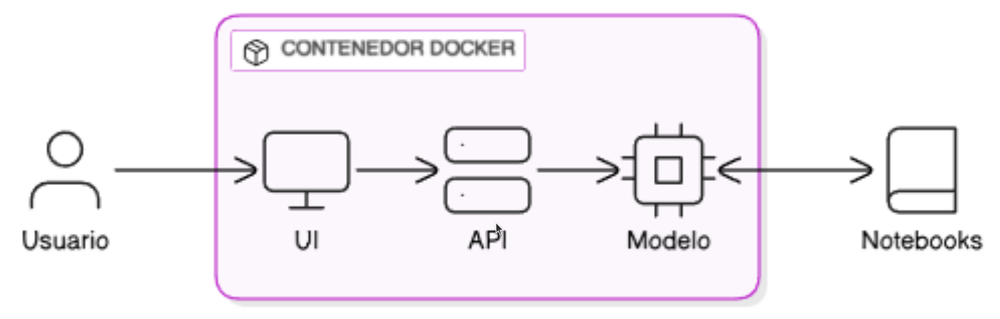

# Despliegue de modelos

## Infraestructura

- **Nombre del modelo:** modelo.joblib
- **Plataforma de despliegue:** Docker con FastAPI
- **Requisitos técnicos:** 
  - **Hardware:**
    - Mínimo 4GB de RAM
    - 500MB de espacio disponible para la imagen Docker
  - **Software:**
    - Docker Engine instalado
    - Navegador web para acceder a la API (recomendado)
  - **Dependencias:** Especificadas en `requirements.txt`:
    ```plaintext
    aiofiles==24.1.0
    annotated-types==0.7.0
    anyio==4.5.2
    click==8.1.8
    exceptiongroup==1.3.0
    fastapi==0.116.1
    h11==0.16.0
    idna==3.10
    Jinja2==3.1.6
    joblib==1.4.2
    MarkupSafe==2.1.5
    numpy==1.24.4
    pydantic==2.10.6
    pydantic_core==2.27.2
    scikit-learn==1.3.2
    scipy==1.10.1
    sniffio==1.3.1
    starlette==0.44.0
    threadpoolctl==3.5.0
    typing_extensions==4.13.2
    uvicorn==0.33.0
    ```
- **Requisitos de seguridad:** 
  - No se implementaron medidas de seguridad adicionales
- **Diagrama de arquitectura:** Arquitectura del sistema que se utiliza para desplegar el modelo 

## Código de despliegue

- **Archivo principal:** `start.sh`
- **Rutas de acceso a los archivos:**

```
.
├── app/
│   └── model/
│       └── modelo.joblib
│   ├── static/
│       └── styles.css
│   ├── templates/
│       └── index.html
│   ├── .dockerignore
│   ├── Dockerfile
│   ├── main.py
│   ├── requirements.txt
│   └── start.sh
```

- **Variables de entorno:** No se requieren

## Documentación del despliegue

- **Instrucciones de instalación:** 1. Instalar Docker:  
 [Guía oficial de instalación](https://docs.docker.com/get-docker/)
- **Instrucciones de configuración:** 
- No se requiere configuración adicional
- El `Dockerfile` contiene toda la configuración necesaria
- **Instrucciones de uso:** 
```bash
# Dar permisos de ejecución al script (solo primera vez)
chmod +x start.sh

# Iniciar la aplicación
./start.sh

# Acceder a la API en:
http://localhost:8001/
```
- **Instrucciones de mantenimiento:** 
**Actualización del Modelo cuando se disponga de nuevos datos o se quiera mejorar el modelo:**

```bash
# 1. Reentrenar el modelo usando el notebook de entrenamiento
jupyter notebook Codigo/Modelo/main.ipynb

# 2. Generar el nuevo modelo.joblib
#    (Asegurarse que el notebook guarda el modelo actualizado)

# 3. Reemplazar el modelo existente en el directorio de la app

# 4. Detener y eliminar el contenedor actual
docker stop proyecto
docker rm proyecto

# 5. Reconstruir e iniciar el servicio
./start.sh
```

